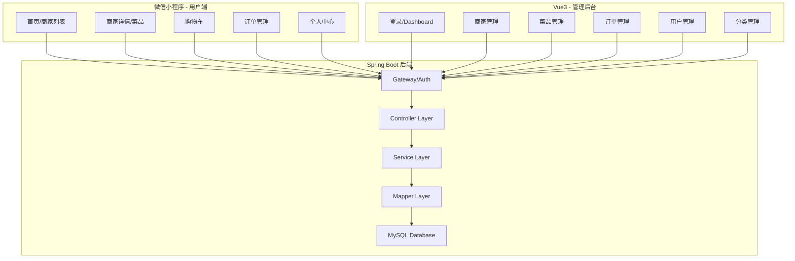
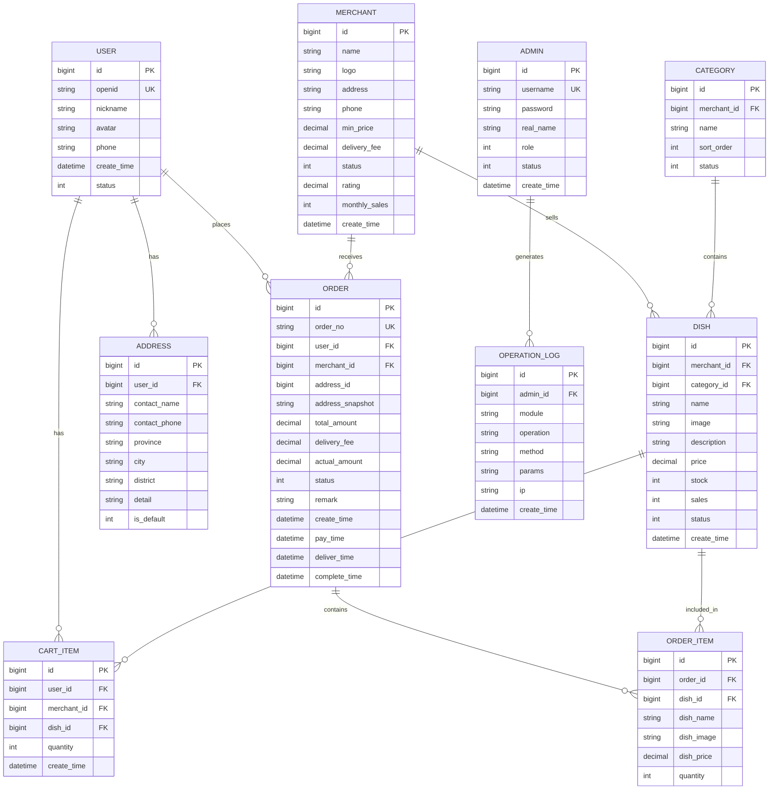

# 微信外卖平台 - 项目设计文档

## 1. 系统架构



## 2. ER 图



## 3. 接口清单

### 3.1 管理端接口

#### AuthController - 认证管理
| Method | Path | Description |
|--------|------|-------------|
| POST | /admin/auth/login | 管理员登录 |
| POST | /admin/auth/logout | 退出登录 |
| GET | /admin/auth/info | 获取当前用户信息 |

#### MerchantController - 商家管理
| Method | Path | Description |
|--------|------|-------------|
| GET | /admin/merchant/page | 分页查询商家 |
| GET | /admin/merchant/{id} | 获取商家详情 |
| POST | /admin/merchant | 新增商家 |
| PUT | /admin/merchant | 更新商家 |
| PUT | /admin/merchant/status | 更新商家状态 |
| DELETE | /admin/merchant/{id} | 删除商家 |

#### CategoryController - 分类管理
| Method | Path | Description |
|--------|------|-------------|
| GET | /admin/category/list | 查询分类列表 |
| POST | /admin/category | 新增分类 |
| PUT | /admin/category | 更新分类 |
| DELETE | /admin/category/{id} | 删除分类 |

#### DishController - 菜品管理
| Method | Path | Description |
|--------|------|-------------|
| GET | /admin/dish/page | 分页查询菜品 |
| GET | /admin/dish/{id} | 获取菜品详情 |
| POST | /admin/dish | 新增菜品 |
| PUT | /admin/dish | 更新菜品 |
| PUT | /admin/dish/status | 更新菜品状态 |
| DELETE | /admin/dish/{id} | 删除菜品 |

#### OrderController - 订单管理
| Method | Path | Description |
|--------|------|-------------|
| GET | /admin/order/page | 分页查询订单 |
| GET | /admin/order/{id} | 获取订单详情 |
| PUT | /admin/order/status | 更新订单状态 |

#### UserController - 用户管理
| Method | Path | Description |
|--------|------|-------------|
| GET | /admin/user/page | 分页查询用户 |
| PUT | /admin/user/status | 更新用户状态 |

#### DashboardController - 数据统计
| Method | Path | Description |
|--------|------|-------------|
| GET | /admin/dashboard/statistics | 获取统计数据 |

### 3.2 小程序端接口

#### WxAuthController - 微信认证
| Method | Path | Description |
|--------|------|-------------|
| POST | /wx/auth/login | 微信登录 |
| GET | /wx/auth/info | 获取用户信息 |
| PUT | /wx/auth/info | 更新用户信息 |

#### WxMerchantController - 商家浏览
| Method | Path | Description |
|--------|------|-------------|
| GET | /wx/merchant/list | 获取商家列表 |
| GET | /wx/merchant/{id} | 获取商家详情 |

#### WxDishController - 菜品浏览
| Method | Path | Description |
|--------|------|-------------|
| GET | /wx/dish/list | 获取菜品列表 |

#### WxCartController - 购物车
| Method | Path | Description |
|--------|------|-------------|
| GET | /wx/cart/list | 获取购物车列表 |
| POST | /wx/cart/add | 添加购物车 |
| PUT | /wx/cart/update | 更新购物车数量 |
| DELETE | /wx/cart/{id} | 删除购物车项 |
| DELETE | /wx/cart/clear | 清空购物车 |

#### WxAddressController - 地址管理
| Method | Path | Description |
|--------|------|-------------|
| GET | /wx/address/list | 获取地址列表 |
| GET | /wx/address/default | 获取默认地址 |
| POST | /wx/address | 新增地址 |
| PUT | /wx/address | 更新地址 |
| DELETE | /wx/address/{id} | 删除地址 |

#### WxOrderController - 订单管理
| Method | Path | Description |
|--------|------|-------------|
| POST | /wx/order/submit | 提交订单 |
| GET | /wx/order/list | 获取订单列表 |
| GET | /wx/order/{id} | 获取订单详情 |
| PUT | /wx/order/cancel | 取消订单 |
| PUT | /wx/order/confirm | 确认收货 |

## 4. UI/UX 规范

### 4.1 管理端 (Vue3 + Element Plus)

```scss
// 主色调
$primary-color: #409EFF;
$success-color: #67C23A;
$warning-color: #E6A23C;
$danger-color: #F56C6C;
$info-color: #909399;

// 背景色
$bg-color: #F5F7FA;
$card-bg: #FFFFFF;

// 文字颜色
$text-primary: #303133;
$text-regular: #606266;
$text-secondary: #909399;
$text-placeholder: #C0C4CC;

// 边框
$border-color: #DCDFE6;
$border-radius: 8px;
$card-shadow: 0 2px 12px 0 rgba(0, 0, 0, 0.1);

// 间距
$spacing-xs: 8px;
$spacing-sm: 12px;
$spacing-md: 16px;
$spacing-lg: 24px;
$spacing-xl: 32px;
```

### 4.2 小程序端

```scss
// 主色调 - 外卖橙
$primary-color: #FF6B35;
$primary-light: #FFF4F0;

// 辅助色
$success-color: #07C160;
$warning-color: #FFC300;
$danger-color: #EE0A24;

// 背景色
$bg-color: #F7F8FA;
$card-bg: #FFFFFF;

// 文字颜色
$text-primary: #323233;
$text-regular: #646566;
$text-secondary: #969799;

// 边框与圆角
$border-color: #EBEDF0;
$border-radius-sm: 8rpx;
$border-radius-md: 16rpx;
$border-radius-lg: 24rpx;

// 间距
$spacing-xs: 16rpx;
$spacing-sm: 24rpx;
$spacing-md: 32rpx;
$spacing-lg: 48rpx;
```

## 5. 目录结构

```
wechat-food-delivery/
├── docs/                          # 文档目录
│   ├── Requirements.md            # 需求文档
│   ├── API.md                     # 接口文档
│   ├── project_design.md          # 设计文档
│   └── ...
├── backend/                       # Spring Boot 后端
│   ├── pom.xml
│   ├── Dockerfile
│   └── src/
│       └── main/
│           ├── java/com/fooddelivery/
│           │   ├── FoodDeliveryApplication.java
│           │   ├── common/        # 通用模块
│           │   ├── config/        # 配置类
│           │   ├── controller/    # 控制器
│           │   ├── service/       # 服务层
│           │   ├── mapper/        # 数据访问层
│           │   ├── entity/        # 实体类
│           │   ├── dto/           # 数据传输对象
│           │   ├── vo/            # 视图对象
│           │   └── interceptor/   # 拦截器
│           └── resources/
│               ├── application.yml
│               ├── schema.sql
│               └── data.sql
├── frontend-admin/                # Vue3 管理后台
│   ├── package.json
│   ├── vite.config.js
│   ├── Dockerfile
│   ├── nginx.conf
│   └── src/
│       ├── api/                   # API 接口
│       ├── store/                 # Pinia 状态管理
│       ├── views/                 # 页面组件
│       ├── components/            # 公共组件
│       ├── router/                # 路由配置
│       ├── styles/                # 样式文件
│       └── utils/                 # 工具函数
├── frontend-mp/                   # 微信小程序
│   ├── app.js
│   ├── app.json
│   ├── app.wxss
│   ├── pages/                     # 页面
│   ├── components/                # 组件
│   ├── utils/                     # 工具
│   └── api/                       # 接口
└── docker-compose.yml             # Docker 编排配置
```
